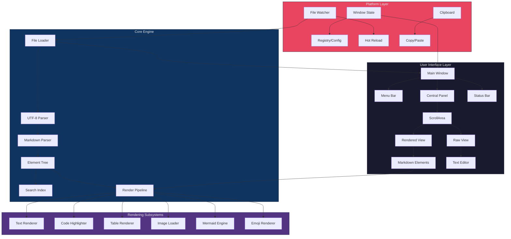
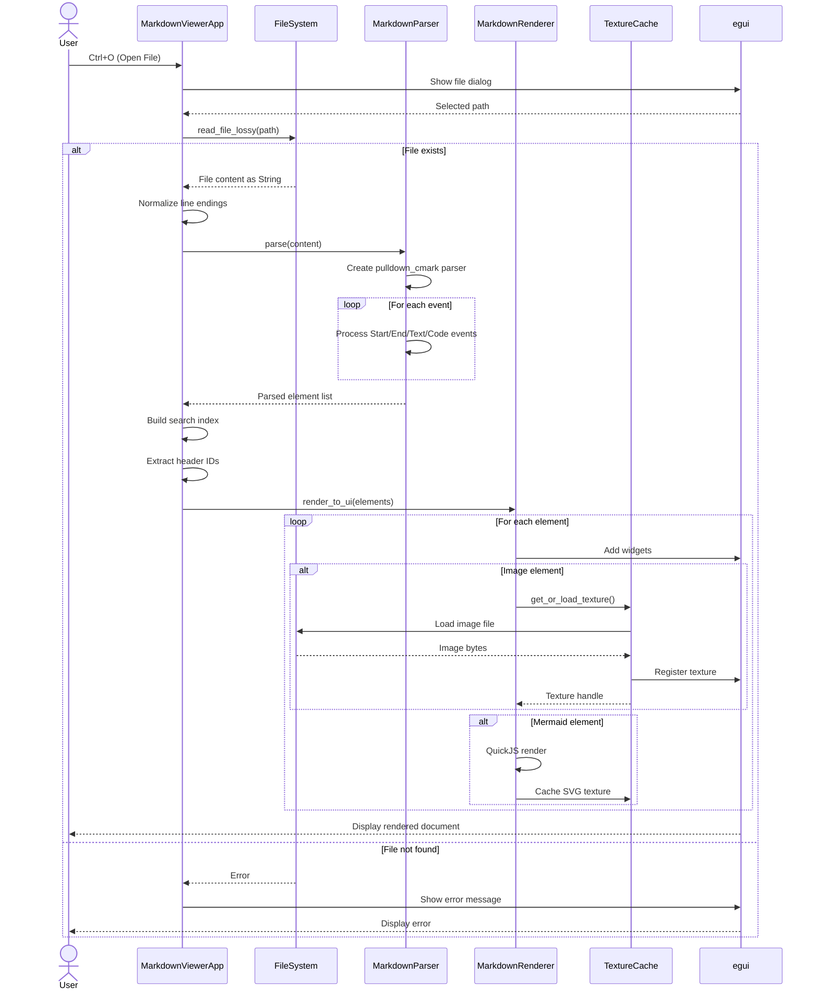
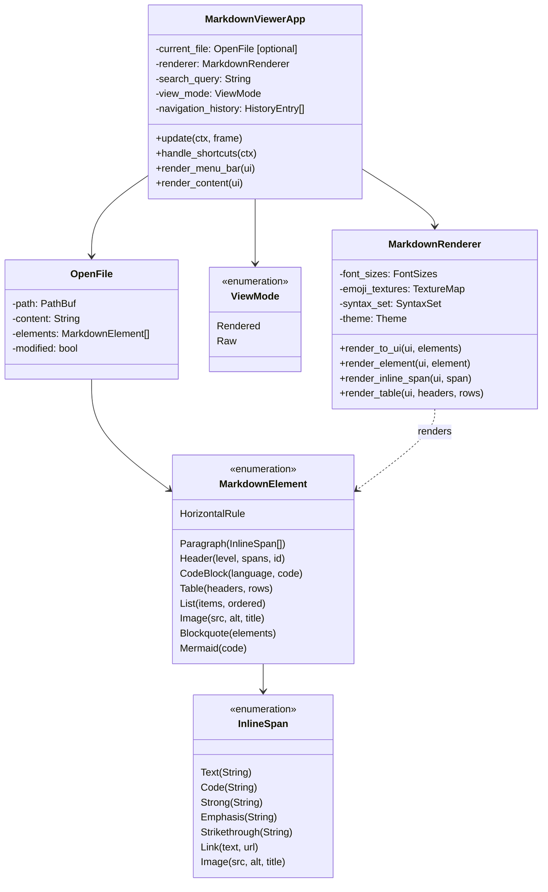
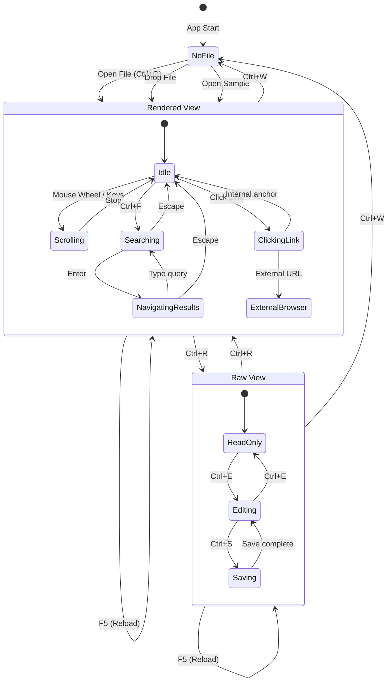
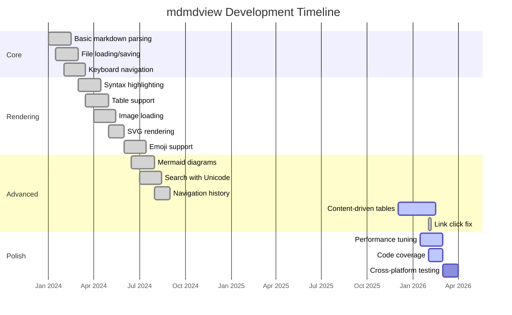
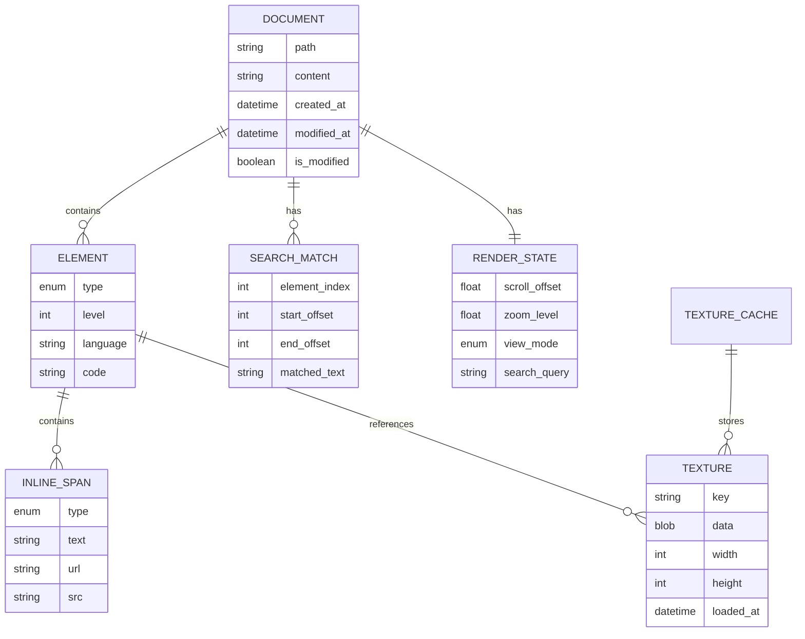
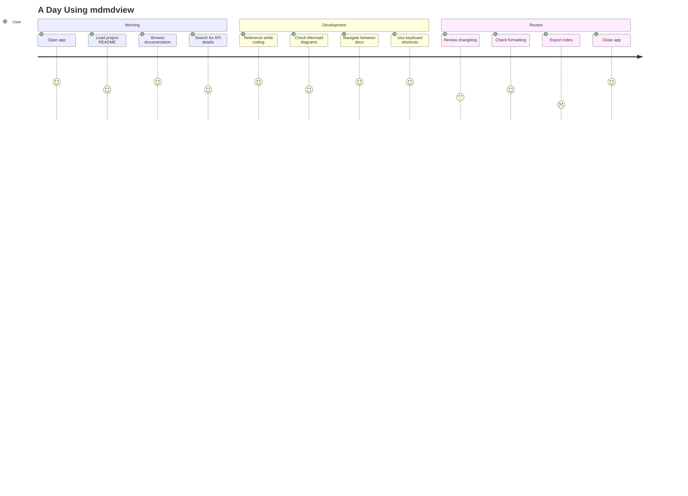
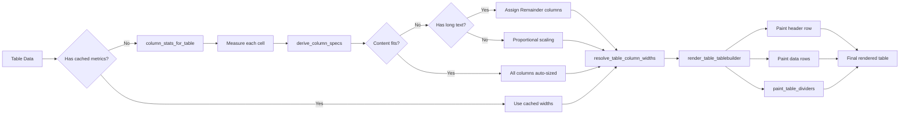

# Stress Test Document

This document is designed to stress-test the markdown renderer with heavy content.

## Table of Contents

- [Code Blocks](#code-blocks)
- [Tables](#tables)
- [Nested Lists](#nested-lists)
- [Mixed Content](#mixed-content)
- [Long Paragraphs](#long-paragraphs)
- [Emojis](#emojis)
- [Mermaid Diagrams](#mermaid-diagrams)
- [Pikchr Diagrams](#pikchr-diagrams)
- [Links](#links)
- [Edge Cases](#edge-cases)

---

## Code Blocks

### Rust Example

```rust
use std::collections::HashMap;
use std::sync::{Arc, Mutex};
use tokio::sync::mpsc;

#[derive(Debug, Clone)]
pub struct MarkdownRenderer {
    cache: Arc<Mutex<HashMap<String, Vec<Element>>>>,
    syntax_set: syntect::parsing::SyntaxSet,
    theme: syntect::highlighting::Theme,
}

impl MarkdownRenderer {
    pub fn new() -> Self {
        let syntax_set = syntect::parsing::SyntaxSet::load_defaults_newlines();
        let theme = syntect::highlighting::ThemeSet::load_defaults()
            .themes["base16-ocean.dark"].clone();

        Self {
            cache: Arc::new(Mutex::new(HashMap::new())),
            syntax_set,
            theme,
        }
    }

    pub fn render(&self, markdown: &str) -> Vec<Element> {
        let parser = pulldown_cmark::Parser::new_ext(
            markdown,
            pulldown_cmark::Options::all(),
        );

        let mut elements = Vec::new();
        let mut current_text = String::new();

        for event in parser {
            match event {
                pulldown_cmark::Event::Start(tag) => {
                    self.handle_start_tag(&mut elements, &mut current_text, tag);
                }
                pulldown_cmark::Event::End(tag) => {
                    self.handle_end_tag(&mut elements, &mut current_text, tag);
                }
                pulldown_cmark::Event::Text(text) => {
                    current_text.push_str(&text);
                }
                pulldown_cmark::Event::Code(code) => {
                    elements.push(Element::InlineCode(code.to_string()));
                }
                _ => {}
            }
        }

        elements
    }
}
```

### TypeScript Example

```typescript
interface MarkdownConfig {
  syntaxHighlighting: boolean;
  lineNumbers: boolean;
  theme: 'dark' | 'light' | 'auto';
  fontSize: number;
  fontFamily: string;
}

class MarkdownEditor {
  private config: MarkdownConfig;
  private content: string = '';
  private history: string[] = [];
  private historyIndex: number = -1;

  constructor(config: Partial<MarkdownConfig> = {}) {
    this.config = {
      syntaxHighlighting: true,
      lineNumbers: true,
      theme: 'dark',
      fontSize: 14,
      fontFamily: 'JetBrains Mono, monospace',
      ...config,
    };
  }

  async loadFile(path: string): Promise<void> {
    const response = await fetch(path);
    if (!response.ok) {
      throw new Error(`Failed to load file: ${response.statusText}`);
    }
    this.content = await response.text();
    this.pushHistory();
  }

  private pushHistory(): void {
    this.history = this.history.slice(0, this.historyIndex + 1);
    this.history.push(this.content);
    this.historyIndex = this.history.length - 1;
  }

  undo(): boolean {
    if (this.historyIndex > 0) {
      this.historyIndex--;
      this.content = this.history[this.historyIndex];
      return true;
    }
    return false;
  }

  redo(): boolean {
    if (this.historyIndex < this.history.length - 1) {
      this.historyIndex++;
      this.content = this.history[this.historyIndex];
      return true;
    }
    return false;
  }
}
```

### Python Example

```python
from dataclasses import dataclass, field
from typing import List, Optional, Dict, Any
from pathlib import Path
import asyncio
import aiofiles

@dataclass
class DocumentMetadata:
    title: str
    author: Optional[str] = None
    created_at: Optional[str] = None
    tags: List[str] = field(default_factory=list)
    custom_fields: Dict[str, Any] = field(default_factory=dict)

class MarkdownProcessor:
    def __init__(self, config: Dict[str, Any] = None):
        self.config = config or {}
        self._cache: Dict[str, str] = {}
        self._plugins: List[callable] = []

    async def process_file(self, path: Path) -> str:
        cache_key = str(path.absolute())

        if cache_key in self._cache:
            return self._cache[cache_key]

        async with aiofiles.open(path, 'r', encoding='utf-8') as f:
            content = await f.read()

        for plugin in self._plugins:
            content = await self._apply_plugin(plugin, content)

        self._cache[cache_key] = content
        return content

    async def _apply_plugin(self, plugin: callable, content: str) -> str:
        if asyncio.iscoroutinefunction(plugin):
            return await plugin(content)
        return plugin(content)

    def register_plugin(self, plugin: callable) -> None:
        self._plugins.append(plugin)

    def clear_cache(self) -> None:
        self._cache.clear()
```

### C++ Example

```cpp
#include <iostream>
#include <vector>
#include <memory>
#include <unordered_map>
#include <functional>

namespace markdown {

template<typename T>
class Pool {
public:
    Pool(size_t initial_size = 1024) {
        blocks_.reserve(initial_size);
    }

    T* allocate() {
        if (free_list_.empty()) {
            blocks_.push_back(std::make_unique<T>());
            return blocks_.back().get();
        }
        T* ptr = free_list_.back();
        free_list_.pop_back();
        return ptr;
    }

    void deallocate(T* ptr) {
        free_list_.push_back(ptr);
    }

private:
    std::vector<std::unique_ptr<T>> blocks_;
    std::vector<T*> free_list_;
};

class Element {
public:
    enum class Type {
        Paragraph,
        Header,
        CodeBlock,
        List,
        Table,
        Image,
        Link
    };

    virtual ~Element() = default;
    virtual Type type() const = 0;
    virtual void render(std::ostream& out) const = 0;
};

class Renderer {
public:
    using RenderFunc = std::function<void(const Element&, std::ostream&)>;

    void register_renderer(Element::Type type, RenderFunc func) {
        renderers_[type] = std::move(func);
    }

    void render(const std::vector<std::unique_ptr<Element>>& elements,
                std::ostream& out) {
        for (const auto& elem : elements) {
            auto it = renderers_.find(elem->type());
            if (it != renderers_.end()) {
                it->second(*elem, out);
            } else {
                elem->render(out);
            }
        }
    }

private:
    std::unordered_map<Element::Type, RenderFunc> renderers_;
};

} // namespace markdown
```

### SQL Example

```sql
-- Create tables for a document management system
CREATE TABLE documents (
    id SERIAL PRIMARY KEY,
    title VARCHAR(255) NOT NULL,
    content TEXT,
    author_id INTEGER REFERENCES users(id),
    created_at TIMESTAMP DEFAULT CURRENT_TIMESTAMP,
    updated_at TIMESTAMP DEFAULT CURRENT_TIMESTAMP,
    is_published BOOLEAN DEFAULT FALSE,
    view_count INTEGER DEFAULT 0
);

CREATE INDEX idx_documents_author ON documents(author_id);
CREATE INDEX idx_documents_created ON documents(created_at DESC);

CREATE TABLE document_tags (
    document_id INTEGER REFERENCES documents(id) ON DELETE CASCADE,
    tag_id INTEGER REFERENCES tags(id) ON DELETE CASCADE,
    PRIMARY KEY (document_id, tag_id)
);

-- Complex query with joins and aggregations
SELECT
    d.id,
    d.title,
    u.username AS author,
    COUNT(DISTINCT dt.tag_id) AS tag_count,
    COUNT(DISTINCT c.id) AS comment_count,
    d.view_count,
    d.created_at
FROM documents d
LEFT JOIN users u ON d.author_id = u.id
LEFT JOIN document_tags dt ON d.id = dt.document_id
LEFT JOIN comments c ON d.id = c.document_id
WHERE d.is_published = TRUE
    AND d.created_at > NOW() - INTERVAL '30 days'
GROUP BY d.id, d.title, u.username, d.view_count, d.created_at
HAVING COUNT(DISTINCT c.id) > 5
ORDER BY d.view_count DESC, d.created_at DESC
LIMIT 50;
```

---

## Tables

### Two-Column Tables (Bug Regression Tests)

These tables previously triggered a bug where both columns would be Fixed,
causing the table to squish to the left instead of filling available width.

| Name | Status |
|------|--------|
| Authentication Module | Complete |
| Database Layer | In Progress |
| API Endpoints | Pending |

| ID | Date |
|----|------|
| 001 | 2026-01-15 |
| 002 | 2026-01-16 |
| 003 | 2026-01-17 |

| Key | State |
|-----|-------|
| config.debug | Enabled |
| config.cache | Disabled |
| config.logging | Enabled |

### Performance Metrics

| Operation | Time (ms) | Memory (MB) | CPU (%) | Status |
|-----------|-----------|-------------|---------|--------|
| File Load | 12.5 | 45.2 | 15 | ✓ Pass |
| Parse Markdown | 8.3 | 12.8 | 22 | ✓ Pass |
| Syntax Highlight | 45.7 | 89.4 | 78 | ⚠ Slow |
| Render Elements | 23.1 | 34.5 | 45 | ✓ Pass |
| Image Loading | 156.2 | 245.8 | 12 | ⚠ Slow |
| Search Index | 5.2 | 8.1 | 8 | ✓ Pass |
| Total | 251.0 | 435.8 | - | ⚠ Review |

### Feature Comparison

| Feature | mdmdview | VS Code | Typora | Obsidian |
|---------|----------|---------|--------|----------|
| Syntax Highlighting | ✓ | ✓ | ✓ | ✓ |
| Mermaid Diagrams | ✓ | Plugin | ✓ | Plugin |
| Live Preview | ✓ | ✓ | ✓ | ✓ |
| Image Support | ✓ | ✓ | ✓ | ✓ |
| Search | ✓ | ✓ | ✓ | ✓ |
| Keyboard Navigation | ✓ | ✓ | Partial | ✓ |
| Single Binary | ✓ | ✗ | ✗ | ✗ |
| Cross-Platform | ✓ | ✓ | ✓ | ✓ |
| Open Source | ✓ | ✓ | ✗ | ✗ |
| Offline Mermaid | ✓ | ✗ | ✓ | ✗ |

### Keyboard Shortcuts Reference

| Action | Windows/Linux | macOS | Description |
|--------|---------------|-------|-------------|
| Open File | Ctrl+O | ⌘O | Open file dialog |
| Close File | Ctrl+W | ⌘W | Close current document |
| Search | Ctrl+F | ⌘F | Toggle search panel |
| Toggle View | Ctrl+R | ⌘R | Switch Rendered/Raw |
| Edit Mode | Ctrl+E | ⌘E | Enable editing in Raw view |
| Reload | F5 | F5 | Reload current file |
| Fullscreen | F11 | F11 | Toggle fullscreen |
| Navigate Back | Alt+← | ⌥← | Go to previous file |
| Navigate Forward | Alt+→ | ⌥→ | Go to next file |
| Zoom In | Ctrl++ | ⌘+ | Increase font size |
| Zoom Out | Ctrl+- | ⌘- | Decrease font size |
| Reset Zoom | Ctrl+0 | ⌘0 | Reset to default size |
| Scroll Top | Home | Home | Scroll to document start |
| Scroll Bottom | End | End | Scroll to document end |

---

## Nested Lists

### Project Structure

- **src/**
  - `main.rs` - Application entry point
    - Window configuration
    - Command-line argument parsing
    - eframe setup
  - `app.rs` - Main application logic
    - State management
    - UI rendering
    - Event handling
      - Keyboard shortcuts
      - Mouse events
      - File drag-and-drop
  - `markdown_renderer.rs` - Markdown rendering
    - Parsing with pulldown-cmark
    - Element conversion
      - Headers
      - Paragraphs
      - Code blocks
        - Syntax highlighting
        - Language detection
      - Tables
      - Lists
      - Images
    - Search highlighting
  - `sample_files.rs` - Embedded samples
  - `window_state.rs` - Window persistence
    - Platform-specific storage
      - Windows: Registry
      - Linux: XDG config
      - macOS: Application Support
- **assets/**
  - `icon.ico` - Application icon
  - `vendor/`
    - `mermaid.min.js` - Mermaid library
- **tests/**
  - Integration tests
  - Unit tests

### Development Roadmap

1. **Phase 1: Core Features** ✓
   - Basic markdown rendering
   - File loading and saving
   - Keyboard navigation
2. **Phase 2: Enhanced Rendering** ✓
   - Syntax highlighting
   - Table support
   - Image loading
     - PNG, JPEG, GIF
     - SVG rendering
     - Live refresh
3. **Phase 3: Advanced Features** (In Progress)
   - Mermaid diagram support
     - Offline rendering via QuickJS
     - Theme integration
   - Search functionality
     - Unicode normalization
     - Accent-insensitive matching
   - Navigation history
4. **Phase 4: Polish**
   - Performance optimization
   - Memory efficiency
   - Error handling improvements
5. **Phase 5: Future**
   - Plugin system
   - Custom themes
   - Export options
     - PDF
     - HTML
     - DOCX

---

## Mixed Content

Here's a paragraph with **bold text**, *italic text*, `inline code`, and a [link to Rust](https://www.rust-lang.org/). You can also have ~~strikethrough~~ text.

> This is a blockquote with some important information.
> It can span multiple lines and contain **formatting**.
>
> > Nested blockquotes are also supported.
> > They can be useful for quoted replies.

### Code with Explanation

The following function demonstrates proper error handling in Rust:

```rust
pub fn read_markdown_file(path: &Path) -> Result<String, Error> {
    // First, check if the file exists
    if !path.exists() {
        return Err(Error::FileNotFound(path.to_path_buf()));
    }

    // Read the file contents
    let content = std::fs::read_to_string(path)
        .map_err(|e| Error::IoError(e))?;

    // Validate UTF-8 encoding
    if content.chars().any(|c| c == '\u{FFFD}') {
        log::warn!("File contains invalid UTF-8 sequences");
    }

    Ok(content)
}
```

The key points are:
1. Check file existence before reading
2. Use `?` operator for error propagation
3. Handle encoding issues gracefully

### Table with Code

| Function | Signature | Description |
|----------|-----------|-------------|
| `parse` | `fn parse(md: &str) -> Vec<Element>` | Parse markdown into elements |
| `render` | `fn render(&self, ui: &mut Ui)` | Render elements to egui |
| `search` | `fn search(&self, query: &str) -> Vec<Match>` | Find matches in content |

---

## Long Paragraphs

Lorem ipsum dolor sit amet, consectetur adipiscing elit. Sed do eiusmod tempor incididunt ut labore et dolore magna aliqua. Ut enim ad minim veniam, quis nostrud exercitation ullamco laboris nisi ut aliquip ex ea commodo consequat. Duis aute irure dolor in reprehenderit in voluptate velit esse cillum dolore eu fugiat nulla pariatur. Excepteur sint occaecat cupidatat non proident, sunt in culpa qui officia deserunt mollit anim id est laborum.

Curabitur pretium tincidunt lacus. Nulla gravida orci a odio. Nullam varius, turpis et commodo pharetra, est eros bibendum elit, nec luctus magna felis sollicitudin mauris. Integer in mauris eu nibh euismod gravida. Duis ac tellus et risus vulputate vehicula. Donec lobortis risus a elit. Etiam tempor. Ut ullamcorper, ligula eu tempor congue, eros est euismod turpis, id tincidunt sapien risus a quam. Maecenas fermentum consequat mi. Donec fermentum. Pellentesque malesuada nulla a mi. Duis sapien sem, aliquet sed, vulputate eget, feugiat non, nisi.

Vestibulum ante ipsum primis in faucibus orci luctus et ultrices posuere cubilia curae; Morbi lacinia molestie dui. Praesent blandit dolor. Sed non quam. In vel mi sit amet augue congue elementum. Morbi in ipsum sit amet pede facilisis laoreet. Donec lacus nunc, viverra nec, blandit vel, egestas et, augue. Vestibulum tincidunt malesuada tellus. Ut ultrices ultrices enim. Curabitur sit amet mauris. Morbi in dui quis est pulvinar ullamcorper.

---

## Repeated Content for Stress Testing

The following sections repeat to create a larger document for performance testing.

### Section A1

```rust
fn process_element(element: &Element) -> String {
    match element {
        Element::Paragraph(spans) => render_spans(spans),
        Element::Header { level, spans, id } => render_header(*level, spans, id),
        Element::CodeBlock { language, code } => highlight_code(language, code),
        Element::List { items, ordered } => render_list(items, *ordered),
        Element::Table { headers, rows } => render_table(headers, rows),
        _ => String::new(),
    }
}
```

| Column A | Column B | Column C | Column D |
|----------|----------|----------|----------|
| Data 1 | Data 2 | Data 3 | Data 4 |
| Data 5 | Data 6 | Data 7 | Data 8 |
| Data 9 | Data 10 | Data 11 | Data 12 |

### Section A2

```typescript
function processElement(element: Element): string {
    switch (element.type) {
        case 'paragraph':
            return renderSpans(element.spans);
        case 'header':
            return renderHeader(element.level, element.spans, element.id);
        case 'codeBlock':
            return highlightCode(element.language, element.code);
        case 'list':
            return renderList(element.items, element.ordered);
        case 'table':
            return renderTable(element.headers, element.rows);
        default:
            return '';
    }
}
```

| Column A | Column B | Column C | Column D |
|----------|----------|----------|----------|
| Value 1 | Value 2 | Value 3 | Value 4 |
| Value 5 | Value 6 | Value 7 | Value 8 |
| Value 9 | Value 10 | Value 11 | Value 12 |

### Section A3

```python
def process_element(element: Element) -> str:
    handlers = {
        'paragraph': lambda e: render_spans(e.spans),
        'header': lambda e: render_header(e.level, e.spans, e.id),
        'code_block': lambda e: highlight_code(e.language, e.code),
        'list': lambda e: render_list(e.items, e.ordered),
        'table': lambda e: render_table(e.headers, e.rows),
    }
    handler = handlers.get(element.type, lambda e: '')
    return handler(element)
```

| Column A | Column B | Column C | Column D |
|----------|----------|----------|----------|
| Item 1 | Item 2 | Item 3 | Item 4 |
| Item 5 | Item 6 | Item 7 | Item 8 |
| Item 9 | Item 10 | Item 11 | Item 12 |

### Section B1

- First level item 1
  - Second level item 1
    - Third level item 1
    - Third level item 2
  - Second level item 2
- First level item 2
  - Second level item 3
    - Third level item 3
      - Fourth level item 1
      - Fourth level item 2
    - Third level item 4
  - Second level item 4
- First level item 3

### Section B2

1. First ordered item
   1. Nested ordered item 1
   2. Nested ordered item 2
      1. Deep nested item 1
      2. Deep nested item 2
   3. Nested ordered item 3
2. Second ordered item
   1. Another nested item
   2. And another
3. Third ordered item

### Section B3

> Blockquote level 1
> > Blockquote level 2
> > > Blockquote level 3
> > > > Blockquote level 4
> > >
> > > Back to level 3
> >
> > Back to level 2
>
> Back to level 1

---

### Section C1

Here is some **bold** and *italic* and ***bold italic*** text. Also `inline code` and ~~strikethrough~~.

Here is some **bold** and *italic* and ***bold italic*** text. Also `inline code` and ~~strikethrough~~.

Here is some **bold** and *italic* and ***bold italic*** text. Also `inline code` and ~~strikethrough~~.

### Section C2

Here is some **bold** and *italic* and ***bold italic*** text. Also `inline code` and ~~strikethrough~~.

Here is some **bold** and *italic* and ***bold italic*** text. Also `inline code` and ~~strikethrough~~.

Here is some **bold** and *italic* and ***bold italic*** text. Also `inline code` and ~~strikethrough~~.

### Section C3

Here is some **bold** and *italic* and ***bold italic*** text. Also `inline code` and ~~strikethrough~~.

Here is some **bold** and *italic* and ***bold italic*** text. Also `inline code` and ~~strikethrough~~.

Here is some **bold** and *italic* and ***bold italic*** text. Also `inline code` and ~~strikethrough~~.

---

## More Code Blocks

### Go Example

```go
package main

import (
    "context"
    "fmt"
    "sync"
    "time"
)

type Document struct {
    ID        string
    Title     string
    Content   string
    CreatedAt time.Time
    UpdatedAt time.Time
}

type DocumentStore struct {
    mu        sync.RWMutex
    documents map[string]*Document
}

func NewDocumentStore() *DocumentStore {
    return &DocumentStore{
        documents: make(map[string]*Document),
    }
}

func (s *DocumentStore) Get(ctx context.Context, id string) (*Document, error) {
    s.mu.RLock()
    defer s.mu.RUnlock()

    doc, ok := s.documents[id]
    if !ok {
        return nil, fmt.Errorf("document not found: %s", id)
    }
    return doc, nil
}

func (s *DocumentStore) Put(ctx context.Context, doc *Document) error {
    s.mu.Lock()
    defer s.mu.Unlock()

    doc.UpdatedAt = time.Now()
    if doc.CreatedAt.IsZero() {
        doc.CreatedAt = doc.UpdatedAt
    }
    s.documents[doc.ID] = doc
    return nil
}

func (s *DocumentStore) Delete(ctx context.Context, id string) error {
    s.mu.Lock()
    defer s.mu.Unlock()

    if _, ok := s.documents[id]; !ok {
        return fmt.Errorf("document not found: %s", id)
    }
    delete(s.documents, id)
    return nil
}
```

### Java Example

```java
package com.example.markdown;

import java.util.*;
import java.util.concurrent.*;
import java.util.stream.*;

public class MarkdownProcessor {
    private final Map<String, String> cache;
    private final ExecutorService executor;
    private final List<Plugin> plugins;

    public MarkdownProcessor() {
        this.cache = new ConcurrentHashMap<>();
        this.executor = Executors.newFixedThreadPool(
            Runtime.getRuntime().availableProcessors()
        );
        this.plugins = new CopyOnWriteArrayList<>();
    }

    public CompletableFuture<String> processAsync(String markdown) {
        return CompletableFuture.supplyAsync(() -> {
            String result = markdown;
            for (Plugin plugin : plugins) {
                result = plugin.process(result);
            }
            return result;
        }, executor);
    }

    public String process(String markdown) {
        String cacheKey = computeHash(markdown);
        return cache.computeIfAbsent(cacheKey, k -> {
            String result = markdown;
            for (Plugin plugin : plugins) {
                result = plugin.process(result);
            }
            return result;
        });
    }

    public void registerPlugin(Plugin plugin) {
        plugins.add(Objects.requireNonNull(plugin));
    }

    public void shutdown() {
        executor.shutdown();
        try {
            if (!executor.awaitTermination(60, TimeUnit.SECONDS)) {
                executor.shutdownNow();
            }
        } catch (InterruptedException e) {
            executor.shutdownNow();
            Thread.currentThread().interrupt();
        }
    }

    private String computeHash(String input) {
        return Integer.toHexString(input.hashCode());
    }

    @FunctionalInterface
    public interface Plugin {
        String process(String input);
    }
}
```

### Shell Script Example

```bash
#!/bin/bash

set -euo pipefail

# Configuration
readonly SCRIPT_DIR="$(cd "$(dirname "${BASH_SOURCE[0]}")" && pwd)"
readonly BUILD_DIR="${SCRIPT_DIR}/target"
readonly LOG_FILE="${BUILD_DIR}/build.log"

# Colors for output
readonly RED='\033[0;31m'
readonly GREEN='\033[0;32m'
readonly YELLOW='\033[1;33m'
readonly NC='\033[0m' # No Color

log_info() {
    echo -e "${GREEN}[INFO]${NC} $*"
}

log_warn() {
    echo -e "${YELLOW}[WARN]${NC} $*"
}

log_error() {
    echo -e "${RED}[ERROR]${NC} $*" >&2
}

build_project() {
    log_info "Building project..."

    mkdir -p "${BUILD_DIR}"

    if cargo build --release 2>&1 | tee "${LOG_FILE}"; then
        log_info "Build successful!"
        return 0
    else
        log_error "Build failed. Check ${LOG_FILE} for details."
        return 1
    fi
}

run_tests() {
    log_info "Running tests..."

    if cargo test 2>&1 | tee -a "${LOG_FILE}"; then
        log_info "All tests passed!"
        return 0
    else
        log_error "Tests failed. Check ${LOG_FILE} for details."
        return 1
    fi
}

main() {
    log_info "Starting build process..."

    build_project || exit 1
    run_tests || exit 1

    log_info "Build process completed successfully!"
}

main "$@"
```

---

## Final Large Table

| ID | Name | Type | Status | Priority | Created | Updated | Author | Tags |
|----|------|------|--------|----------|---------|---------|--------|------|
| 1 | Feature A | Feature | Done | High | 2024-01-01 | 2024-01-15 | Alice | core, ui |
| 2 | Bug B | Bug | In Progress | Critical | 2024-01-02 | 2024-01-16 | Bob | urgent |
| 3 | Task C | Task | Todo | Medium | 2024-01-03 | 2024-01-03 | Carol | backend |
| 4 | Feature D | Feature | In Review | High | 2024-01-04 | 2024-01-17 | Dave | api |
| 5 | Bug E | Bug | Done | Low | 2024-01-05 | 2024-01-10 | Eve | docs |
| 6 | Task F | Task | In Progress | Medium | 2024-01-06 | 2024-01-18 | Frank | testing |
| 7 | Feature G | Feature | Todo | High | 2024-01-07 | 2024-01-07 | Grace | core |
| 8 | Bug H | Bug | Done | Critical | 2024-01-08 | 2024-01-12 | Henry | security |
| 9 | Task I | Task | In Review | Low | 2024-01-09 | 2024-01-19 | Iris | cleanup |
| 10 | Feature J | Feature | In Progress | High | 2024-01-10 | 2024-01-20 | Jack | ui, ux |
| 11 | Bug K | Bug | Todo | Medium | 2024-01-11 | 2024-01-11 | Kate | mobile |
| 12 | Task L | Task | Done | High | 2024-01-12 | 2024-01-14 | Leo | perf |
| 13 | Feature M | Feature | In Progress | Critical | 2024-01-13 | 2024-01-21 | Mia | auth |
| 14 | Bug N | Bug | In Review | High | 2024-01-14 | 2024-01-22 | Nick | api |
| 15 | Task O | Task | Todo | Low | 2024-01-15 | 2024-01-15 | Olivia | docs |
| 16 | Feature P | Feature | Done | Medium | 2024-01-16 | 2024-01-20 | Pete | export |
| 17 | Bug Q | Bug | In Progress | High | 2024-01-17 | 2024-01-23 | Quinn | render |
| 18 | Task R | Task | Done | Medium | 2024-01-18 | 2024-01-19 | Rose | refactor |
| 19 | Feature S | Feature | Todo | High | 2024-01-19 | 2024-01-19 | Sam | search |
| 20 | Bug T | Bug | In Review | Critical | 2024-01-20 | 2024-01-24 | Tina | crash |

---

## Emojis

### Unicode Emojis in Text

Here's a paragraph with emojis inline: The 🚀 rocket launched at dawn, leaving a trail of 🔥 fire across the 🌅 sky. Scientists 👨‍🔬👩‍🔬 watched from the 🏗️ launchpad while 📡 tracking stations around the 🌍 globe monitored its trajectory.

### Shortcode Emojis

These use the `:name:` shortcode syntax: :rocket: :fire: :star: :heart: :thumbsup: :warning: :bulb: :tada: :zap: :sparkles:

### Emojis in Headers

#### 🎯 Target Accuracy Report

#### 🔧 Maintenance Schedule

#### 📊 Quarterly Results

#### ⚡ Performance Metrics

### Emojis with Formatting

- **🚀 Bold rocket** and *🌟 italic star*
- ***🔥 Bold italic fire*** with ~~❌ strikethrough cross~~
- `📝 code emoji` alongside 💻 regular emoji
- A [🔗 link with emoji](https://example.com) and a [🌐 another link](https://example.org)

### Emojis in Tables

| Emoji | Name | Category | Status |
|-------|------|----------|--------|
| 🚀 | Rocket | Transport | ✅ Active |
| 🎯 | Target | Activity | ✅ Active |
| 🔥 | Fire | Nature | ⚠️ Caution |
| 💎 | Gem | Objects | ✅ Active |
| 🌊 | Wave | Nature | ✅ Active |
| 🎨 | Palette | Activity | 🔄 In Progress |
| 🛡️ | Shield | Objects | ✅ Active |
| 🧪 | Test Tube | Science | 🔬 Testing |

### Complex Emoji Sequences

Flags: 🇬🇧 🇺🇸 🇫🇷 🇩🇪 🇯🇵 🇦🇺 🇨🇦 🇧🇷

Family sequences: 👨‍👩‍👧‍👦 👩‍👩‍👦 👨‍👨‍👧

Skin tones: 👋🏻 👋🏼 👋🏽 👋🏾 👋🏿

Profession emojis: 👩‍💻 👨‍🔬 👩‍🎨 👨‍🚀 👩‍⚕️ 👨‍🍳

### Mixed Emoji Paragraphs

The development team 👨‍💻👩‍💻 completed **Sprint 14** :tada: with outstanding results! Here's the summary:

> 🎯 **Goal**: Ship the v2.0 release
> ✅ All 47 user stories completed
> 🐛 Zero critical bugs at release
> 📈 Performance improved by 35%
> 🌟 Customer satisfaction: 4.8/5

The :rocket: deployment went smoothly, and the :chart_with_upwards_trend: metrics look great. Special thanks to the QA team 🧪 for their thorough testing!

---

## Mermaid Diagrams

### Architecture Flowchart



### Sequence Diagram — File Open Flow



### Class Diagram — Core Types



### State Diagram — View Mode Transitions



### Gantt Chart — Development Timeline



### Entity Relationship Diagram



### Journey Diagram — User Experience



### Complex Flowchart — Table Rendering Pipeline



---

## Pikchr Diagrams

### Simple Flow

```pikchr
arrow right 200% "Request" above
box "Server" fit rad 10px
arrow right 200% "Response" above
```

### Architecture Diagram

```pikchr
box "Browser" fit rad 10px
arrow right 250% "HTTP" above
box "Web Server" fit rad 10px
arrow right 250% "SQL" above
cylinder "Database" fit
```

### Decision Flow

```pikchr
box "Start" fit rad 50%
arrow from last box.s down
diamond "OK?" fit
arrow from last diamond.e right 200% "Yes" above
box "Done" fit rad 50%
arrow from last diamond.s down "No" ljust
box "Retry" fit rad 10px
arrow from last box.w left 0.5in \
  then up until even with 1st box \
  then right to 1st box.w
```

### Shape Gallery

```pikchr
box "Box" fit
move right 0.5in
circle "Circle" fit
move right 0.5in
ellipse "Ellipse" fit
move right 0.5in
cylinder "Cylinder" fit
move right 0.5in
file "File" fit
```

### Pipeline Diagram

```pikchr
file "Source" fit
arrow right 150% "read" above
box "Parse" fit rad 10px
arrow right 150% "tokens" above
box "Transform" fit rad 10px
arrow right 150% "emit" above
file "Output" fit
```

### Labeled Connections

```pikchr
box "Client" fit rad 10px
arrow right 300% "GET /api/data" above "200 OK + JSON" below
box "API" fit rad 10px
arrow right 300% "SELECT *" above "rows" below
cylinder "DB" fit
```

---

## Links

### Various Link Types

- External link: [Rust Programming Language](https://www.rust-lang.org/)
- External link: [egui Documentation](https://docs.rs/egui/latest/egui/)
- Internal anchor: [Back to Code Blocks](#code-blocks)
- Internal anchor: [Jump to Tables](#tables)
- Internal anchor: [See Emojis](#emojis)
- Internal anchor: [See Mermaid Diagrams](#mermaid-diagrams)
- Link with formatting: [**Bold link text**](https://example.com)
- Link with emoji: [🚀 Launch Page](https://example.com/launch)
- Link with code context: See the [`render_table`](https://example.com/docs) function

### Links in Paragraphs

The [Rust](https://www.rust-lang.org/) programming language provides memory safety without garbage collection. Combined with [egui](https://github.com/emilk/egui) for immediate-mode GUI, and [pulldown-cmark](https://github.com/pulldown-cmark/pulldown-cmark) for CommonMark parsing, [mdmdview](https://github.com/0x4D44/mdmdview) delivers a fast, single-binary markdown viewer. For syntax highlighting, it uses [syntect](https://github.com/trishume/syntect), and for Mermaid diagrams, [rquickjs](https://github.com/nickel-org/rquickjs) provides embedded JavaScript execution.

---

## Edge Cases

### Single-Column Table

| Status |
|--------|
| Active |
| Inactive |
| Pending |
| Archived |
| Deleted |

### Very Wide Table (Many Columns)

| A | B | C | D | E | F | G | H | I | J | K | L |
|---|---|---|---|---|---|---|---|---|---|---|---|
| 1 | 2 | 3 | 4 | 5 | 6 | 7 | 8 | 9 | 10 | 11 | 12 |
| alpha | bravo | charlie | delta | echo | foxtrot | golf | hotel | india | juliet | kilo | lima |

### Table with Long Cell Content

| Feature | Description | Implementation Notes |
|---------|-------------|---------------------|
| Syntax Highlighting | Supports 50+ programming languages via the syntect library with the base16-ocean-dark theme for consistent dark-mode appearance | Uses lazy initialization to avoid loading all syntax definitions at startup; caches highlighted output per code block |
| Mermaid Diagrams | Offline rendering of flowcharts, sequence diagrams, class diagrams, state diagrams, Gantt charts, ER diagrams, and more via embedded QuickJS JavaScript engine | The Mermaid.js library is compiled into the binary at build time; SVG output is rasterized via resvg/tiny-skia and cached as egui textures |
| Unicode Search | Accent-insensitive, case-folded search using Unicode normalization (NFC/NFD) with grapheme-cluster-aware highlighting that preserves emoji and combining characters | Uses unicode-normalization and unicode-casefold crates; searches normalized copies while highlighting original text positions |

### Empty Table

| | |
|-|-|
| | |

### Deeply Nested Blockquotes

> Level 1: The outer context
> > Level 2: A response
> > > Level 3: A clarification
> > > > Level 4: Further detail
> > > > > Level 5: Maximum reasonable depth
> > > >
> > > > Back to level 4 with **bold** and *italic*
> > >
> > > Level 3 with `inline code` and a [link](#edge-cases)
> >
> > Level 2 with a list:
> > - Item one
> > - Item two
> > - Item three
>
> Back at level 1.

### Mixed Inline Formatting Stress

This paragraph has **bold**, *italic*, ***bold italic***, `code`, ~~strikethrough~~, **`bold code`**, *`italic code`*, [a link](https://example.com), and 🎯 emojis all **mixed *together* in ~~various ~~** combinations to test the inline span renderer thoroughly.

### Consecutive Horizontal Rules

---

---

---

### Adjacent Code Blocks (No Gap)

```rust
fn first() -> i32 { 1 }
```

```rust
fn second() -> i32 { 2 }
```

```rust
fn third() -> i32 { 3 }
```

### Very Long Single Line

This is a single line that goes on and on and on without any line breaks to test how the renderer handles horizontal overflow and text wrapping in a paragraph context: Lorem ipsum dolor sit amet consectetur adipiscing elit sed do eiusmod tempor incididunt ut labore et dolore magna aliqua ut enim ad minim veniam quis nostrud exercitation ullamco laboris nisi ut aliquip ex ea commodo consequat duis aute irure dolor in reprehenderit in voluptate velit esse cillum dolore eu fugiat nulla pariatur excepteur sint occaecat cupidatat non proident sunt in culpa qui officia deserunt mollit anim id est laborum.

### Line Breaks in Poetry

Roses are red,
Violets are blue,
Markdown preserves
Line breaks for you.

The fog comes
on little cat feet.
It sits looking
over harbor and city
on silent haunches
and then moves on.

---

## End of Stress Test Document

This document contains:
- Multiple code blocks with syntax highlighting (Rust, TypeScript, Python, C++, SQL, Go, Java, Bash)
- Multiple tables with various column counts (1-column, 2-column, 4-column, 9-column, 12-column)
- Deeply nested lists (both ordered and unordered)
- Blockquotes with multiple nesting levels (up to 5 deep)
- Mixed inline formatting
- Long paragraphs
- Repeated sections for volume
- Unicode and shortcode emojis (flags, skin tones, ZWJ sequences)
- Emojis in headers, tables, links, and formatted text
- Complex Mermaid diagrams (flowchart, sequence, class, state, gantt, ER, journey)
- Pikchr diagrams (flow, architecture, decision, shape gallery, pipeline, labeled connections)
- Various link types (external, internal anchor, formatted, emoji links)
- Edge cases (empty tables, long cells, adjacent code blocks, very long lines, poetry)

Total approximate element count: 350+ markdown elements
