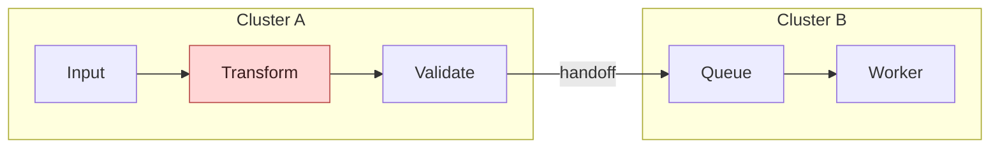

# Mermaid Flowchart Subgraph

```mermaid
flowchart LR
    subgraph Cluster A
        A1[Input] --> A2[Transform]
        A2 --> A3[Validate]
    end
    subgraph Cluster B
        B1[Queue] --> B2[Worker]
    end
    A3 -->|handoff| B1
    classDef hot fill:#FFD6D6,stroke:#B94A48,color:#3A1C1C;
    class A2 hot;
```
