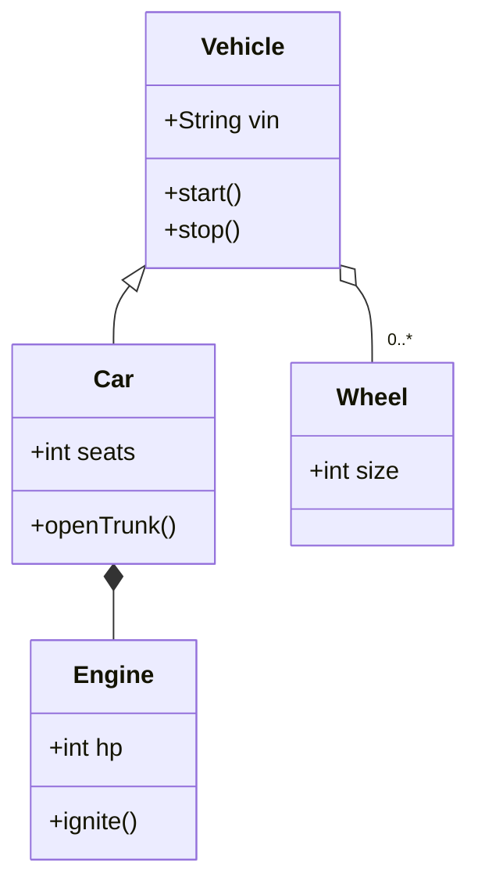

```mermaid
classDiagram
    class Vehicle {
        +String vin
        +start()
        +stop()
    }
    class Car {
        +int seats
        +openTrunk()
    }
    class Engine {
        +int hp
        +ignite()
    }
    class Wheel {
        +int size
    }
    Vehicle <|-- Car
    Car *-- Engine
    Vehicle o-- "0..*" Wheel
```
