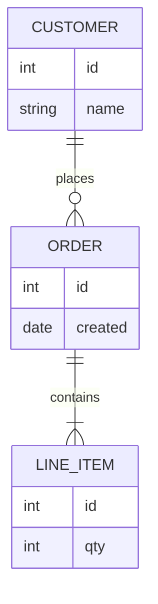

```mermaid
erDiagram
    CUSTOMER ||--o{ ORDER : places
    ORDER ||--|{ LINE_ITEM : contains
    CUSTOMER {
        int id
        string name
    }
    ORDER {
        int id
        date created
    }
    LINE_ITEM {
        int id
        int qty
    }
```
