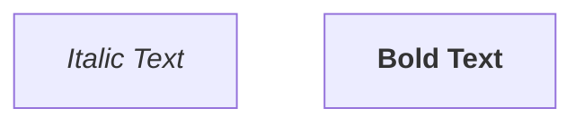
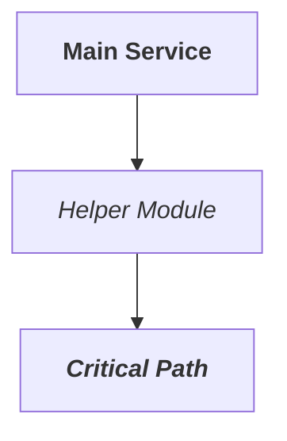

# High-Level Design: Mermaid HTML Tag Rendering Support

**Date:** 2026-01-28
**Author:** Claude Opus 4.5
**Status:** Draft
**Version:** 2.0.0

---

## Revision History

| Version | Date | Changes |
|---------|------|---------|
| 1.0.0 | 2026-01-28 | Initial draft |
| 2.0.0 | 2026-01-28 | Major revision after design review: added tag stack tracking, Rust post-processing alternative, feature flag, corrected usvg limitations, improved testing strategy |

---

## 1. Executive Summary

This document describes the design for enabling HTML formatting tags (`<i>`, `<b>`, `<em>`, `<strong>`) in Mermaid diagram labels. Currently, these tags are displayed as literal text (e.g., `<i>Voice AI Agent</i>`) instead of being rendered with the appropriate styling.

### Problem Statement

When users include HTML formatting in Mermaid diagram labels:


The current output shows literal tags: `<i>Italic Text</i>` instead of rendering *Italic Text* in italics.

### Proposed Solution

**Primary approach (Recommended):** Post-process the SVG string in Rust after QuickJS returns it, converting escaped HTML tags to SVG `<tspan>` elements before passing to usvg/resvg.

**Alternative approach:** Convert HTML tags in JavaScript during DOM serialization.

---

## 2. Background

### 2.1 Current Architecture

```
┌──────────────────────────────────────────────────────────────────┐
│ 1. Markdown Parser (Rust)                                        │
│    - Extracts Mermaid code blocks                                │
└──────────────────────────────────────────────────────────────────┘
                                │
                                ▼
┌──────────────────────────────────────────────────────────────────┐
│ 2. QuickJS Runtime (JavaScript)                                  │
│    - Runs Mermaid.js with htmlLabels=false                       │
│    - Custom DOM shim serializes to SVG string                    │
│    - HTML tags in labels become escaped: &lt;i&gt;              │
└──────────────────────────────────────────────────────────────────┘
                                │
                                ▼
┌──────────────────────────────────────────────────────────────────┐
│ 3. SVG Post-Processing (Rust)                      ◄── NEW CODE │
│    - Convert &lt;i&gt; to <tspan font-style="italic">          │
│    - flatten_svg_switches() removes <foreignObject>             │
│    - Various SVG fixups                                          │
└──────────────────────────────────────────────────────────────────┘
                                │
                                ▼
┌──────────────────────────────────────────────────────────────────┐
│ 4. Rasterization (Rust)                                          │
│    - usvg parses SVG                                             │
│    - resvg renders to pixels                                     │
└──────────────────────────────────────────────────────────────────┘
```

### 2.2 Root Cause Analysis

1. **usvg limitation**: Cannot render `<foreignObject>` SVG elements (required for HTML content in SVG)

2. **Defensive configuration**: `should_allow_html_labels()` returns `false` to prevent invisible text:
   ```rust
   fn should_allow_html_labels(_code: &str) -> bool {
       // usvg cannot render foreignObject elements
       false
   }
   ```

3. **Text escaping**: With `htmlLabels=false`, Mermaid.js places labels in `<text>` elements. The `__mdmdview_escape_text()` function escapes all content:
   ```javascript
   function __mdmdview_escape_text(text) {
       return String(text)
           .replace(/&/g, '&amp;')
           .replace(/</g, '&lt;')
           .replace(/>/g, '&gt;');
   }
   ```

4. **Result**: `<i>text</i>` becomes `&lt;i&gt;text&lt;/i&gt;` which renders as literal characters.

---

## 3. Design Review Findings

The following issues were identified in the initial design (v1.0.0):

### 3.1 Critical Issues

| Issue | Description | Resolution |
|-------|-------------|------------|
| **Tag stack tracking missing** | Closing tags for unopened tags would emit invalid `</tspan>`. E.g., `<i>text</b>` would emit `</tspan>` for `</b>` even though `<b>` was never opened. | Track opened tags in a stack; only emit `</tspan>` for matching opens |
| **Two integration points** | JavaScript has two places calling `__mdmdview_escape_text`: line 3664 (for `#text` nodes) and line 3689 (for leaf nodes). Both need modification. | Prefer Rust post-processing which has single integration point |
| **No feature flag** | No way to disable the feature if issues arise | Add `MDMDVIEW_MERMAID_HTML_TAGS` environment variable |

### 3.2 usvg Capability Verification

| Feature | usvg Support | Notes |
|---------|--------------|-------|
| `font-style="italic"` | **Supported** | Core text attribute |
| `font-weight="bold"` | **Supported** | Core text attribute |
| `text-decoration="underline"` | **Partial** | usvg has `TextDecoration` struct with underline support, but may require style attribute not attribute syntax |
| `text-decoration="line-through"` | **Partial** | Same as underline |
| `baseline-shift="sub/super"` | **Partial** | Supported but uses font metrics; results may vary |
| Nested `<tspan>` | **Supported** | Attributes inherit/cascade correctly |

**Recommendation:** Focus on `<i>`, `<em>`, `<b>`, `<strong>` for initial implementation. Mark `<u>`, `<s>`, `<sub>`, `<sup>` as experimental.

### 3.3 Additional Issues

| Issue | Description | Resolution |
|-------|-------------|------------|
| **Angle brackets in non-tags** | `x < 5` or `a > b` could be misinterpreted | Require closing `>` immediately after tag name; don't treat `< 5` as tag |
| **tagMappings recreation** | JavaScript creates mapping object on every call | Move to constant (or use Rust approach) |
| **HTML entities** | `&nbsp;` `&#60;` etc. not addressed | Pass through unchanged; usvg handles standard XML entities |
| **Quote escaping** | Original code doesn't escape `"` in text content | Match original behavior |
| **Testing strategy** | Only visual testing proposed | Add Rust unit tests with SVG assertions |

---

## 4. Proposed Solution: Rust SVG Post-Processing

### 4.1 Rationale

Processing in Rust rather than JavaScript offers significant advantages:

| Aspect | JavaScript Approach | Rust Approach |
|--------|---------------------|---------------|
| **Testability** | Requires QuickJS integration testing | Standard Rust unit tests |
| **Maintainability** | Embedded in string literals | Normal Rust functions |
| **Debugging** | Limited visibility | Full Rust debugging |
| **Integration points** | Two places to modify | Single post-processing step |
| **Type safety** | None | Full Rust type checking |

### 4.2 Integration Point

The SVG string is processed in `process_job()` after Mermaid.js rendering completes and before rasterization. Current flow:

```rust
// In process_job() around line 2500
let svg = render_result.svg;
let svg = flatten_svg_switches(&svg).unwrap_or(svg);
let svg = fix_state_end_circles(&svg);
// ... other fixups ...
// NEW: Convert HTML tags to tspan
let svg = convert_html_tags_to_tspan(&svg);
// Then rasterize
rasterize_svg(&svg, ...)
```

### 4.3 Algorithm

The conversion operates on `<text>` and `<tspan>` element content within the SVG:

```
Input SVG:
<text>&lt;b&gt;Bold &lt;i&gt;and italic&lt;/i&gt;&lt;/b&gt;</text>

Step 1: Find <text> elements
Step 2: Unescape HTML entities in content: <b>Bold <i>and italic</i></b>
Step 3: Parse HTML tags with stack tracking
Step 4: Convert to tspan elements

Output SVG:
<text><tspan font-weight="bold">Bold <tspan font-style="italic">and italic</tspan></tspan></text>
```

### 4.4 Core Function Design

```rust
/// Converts escaped HTML formatting tags in SVG text elements to tspan equivalents.
///
/// # Arguments
/// * `svg` - The SVG string from Mermaid rendering
///
/// # Returns
/// The SVG string with HTML tags converted to tspan elements
///
/// # Supported Tags
/// - `<i>`, `<em>` → `<tspan font-style="italic">`
/// - `<b>`, `<strong>` → `<tspan font-weight="bold">`
/// - `<u>` → `<tspan text-decoration="underline">` (experimental)
/// - `<s>`, `<del>` → `<tspan text-decoration="line-through">` (experimental)
fn convert_html_tags_to_tspan(svg: &str) -> String {
    // Check feature flag
    if std::env::var("MDMDVIEW_MERMAID_HTML_TAGS").ok().as_deref() == Some("off") {
        return svg.to_string();
    }

    // Fast path: if no escaped tags, return unchanged
    if !svg.contains("&lt;") {
        return svg.to_string();
    }

    // Process text element contents
    convert_text_element_contents(svg)
}
```

### 4.5 Tag Conversion with Stack Tracking

```rust
/// Tag mapping configuration
struct TagMapping {
    attr: &'static str,
    value: &'static str,
}

/// Supported HTML tags and their SVG equivalents
const TAG_MAPPINGS: &[(&str, TagMapping)] = &[
    ("i",      TagMapping { attr: "font-style", value: "italic" }),
    ("em",     TagMapping { attr: "font-style", value: "italic" }),
    ("b",      TagMapping { attr: "font-weight", value: "bold" }),
    ("strong", TagMapping { attr: "font-weight", value: "bold" }),
    ("u",      TagMapping { attr: "text-decoration", value: "underline" }),
    ("s",      TagMapping { attr: "text-decoration", value: "line-through" }),
    ("del",    TagMapping { attr: "text-decoration", value: "line-through" }),
    ("strike", TagMapping { attr: "text-decoration", value: "line-through" }),
];

/// Converts HTML tags in text content to tspan elements.
///
/// Uses a stack to track opened tags and ensure proper nesting.
fn convert_html_in_text(text: &str) -> String {
    let mut result = String::with_capacity(text.len() * 2);
    let mut tag_stack: Vec<&str> = Vec::new();
    let mut chars = text.chars().peekable();

    while let Some(ch) = chars.next() {
        if ch == '<' {
            // Attempt to parse as HTML tag
            if let Some((tag_name, is_closing, end_pos)) = try_parse_tag(&text[current_pos..]) {
                if let Some(mapping) = find_tag_mapping(tag_name) {
                    if is_closing {
                        // Only emit </tspan> if we have a matching open tag
                        if let Some(pos) = tag_stack.iter().rposition(|&t| t == tag_name) {
                            // Close all tags up to and including the matching one
                            for _ in 0..=(tag_stack.len() - 1 - pos) {
                                result.push_str("</tspan>");
                            }
                            // Re-open any tags that were closed prematurely
                            for i in (pos + 1)..tag_stack.len() {
                                let reopened = tag_stack[i];
                                if let Some(m) = find_tag_mapping(reopened) {
                                    result.push_str(&format!(
                                        "<tspan {}=\"{}\">",
                                        m.attr, m.value
                                    ));
                                }
                            }
                            tag_stack.remove(pos);
                        }
                        // If no matching open tag, ignore the closing tag
                    } else {
                        // Opening tag
                        result.push_str(&format!(
                            "<tspan {}=\"{}\">",
                            mapping.attr, mapping.value
                        ));
                        tag_stack.push(tag_name);
                    }
                    continue;
                }
            }
            // Not a recognized tag - escape it
            result.push_str("&lt;");
        } else if ch == '>' {
            result.push_str("&gt;");
        } else if ch == '&' {
            result.push_str("&amp;");
        } else {
            result.push(ch);
        }
    }

    // Close any unclosed tags
    for _ in &tag_stack {
        result.push_str("</tspan>");
    }

    result
}
```

### 4.6 Tag Parsing

```rust
/// Attempts to parse an HTML tag at the current position.
///
/// # Returns
/// - `Some((tag_name, is_closing, chars_consumed))` if valid tag found
/// - `None` if not a valid tag
///
/// # Tag Recognition Rules
/// 1. Must start with `<` or `</`
/// 2. Tag name must be alphanumeric, start with letter
/// 3. Tag must end with `>` (may have attributes or self-close)
/// 4. Tag name must be in allowlist
fn try_parse_tag(text: &str) -> Option<(&str, bool, usize)> {
    if !text.starts_with('<') {
        return None;
    }

    let is_closing = text.starts_with("</");
    let start = if is_closing { 2 } else { 1 };

    // Find end of tag name (space, /, or >)
    let remaining = &text[start..];
    let name_end = remaining
        .find(|c: char| c == ' ' || c == '/' || c == '>')
        .unwrap_or(remaining.len());

    if name_end == 0 {
        return None; // Empty tag name
    }

    let tag_name = &remaining[..name_end];

    // Validate tag name: must be alphabetic
    if !tag_name.chars().all(|c| c.is_ascii_alphabetic()) {
        return None;
    }

    // Find closing >
    let tag_end = text.find('>')?;

    Some((tag_name, is_closing, tag_end + 1))
}
```

### 4.7 Text Element Processing

```rust
/// Processes all <text> elements in the SVG, converting their content.
fn convert_text_element_contents(svg: &str) -> String {
    let mut result = String::with_capacity(svg.len());
    let mut pos = 0;

    while let Some(text_start) = svg[pos..].find("<text") {
        let text_start = pos + text_start;

        // Copy everything before <text>
        result.push_str(&svg[pos..text_start]);

        // Find the closing >
        let content_start = match svg[text_start..].find('>') {
            Some(i) => text_start + i + 1,
            None => {
                result.push_str(&svg[text_start..]);
                break;
            }
        };

        // Copy the <text ...> opening tag
        result.push_str(&svg[text_start..content_start]);

        // Find </text>
        let content_end = match svg[content_start..].find("</text>") {
            Some(i) => content_start + i,
            None => {
                result.push_str(&svg[content_start..]);
                break;
            }
        };

        // Extract and process content
        let content = &svg[content_start..content_end];
        let unescaped = unescape_html_entities(content);
        let converted = convert_html_in_text(&unescaped);
        result.push_str(&converted);

        // Position after </text>
        pos = content_end;
    }

    // Copy remaining
    result.push_str(&svg[pos..]);
    result
}

/// Unescapes HTML entities back to characters for processing.
fn unescape_html_entities(text: &str) -> String {
    text.replace("&lt;", "<")
        .replace("&gt;", ">")
        .replace("&amp;", "&")
        .replace("&quot;", "\"")
        .replace("&apos;", "'")
}
```

---

## 5. Feature Flag

### 5.1 Environment Variable

```
MDMDVIEW_MERMAID_HTML_TAGS=off    # Disable HTML tag conversion
MDMDVIEW_MERMAID_HTML_TAGS=on     # Enable (default)
```

### 5.2 Implementation

```rust
fn is_html_tag_conversion_enabled() -> bool {
    static ENABLED: std::sync::OnceLock<bool> = std::sync::OnceLock::new();
    *ENABLED.get_or_init(|| {
        std::env::var("MDMDVIEW_MERMAID_HTML_TAGS")
            .map(|v| v.to_lowercase() != "off")
            .unwrap_or(true) // Default: enabled
    })
}
```

---

## 6. Edge Cases

### 6.1 Angle Brackets in Non-Tags

**Input:** `x < 5 and y > 3`

**Expected:** `x &lt; 5 and y &gt; 3` (no conversion, treated as math)

**Handling:** The tag parser requires:
- Valid tag name immediately after `<`
- Tag name must be alphabetic
- Tag must have closing `>`

`< 5` fails because `5` is not alphabetic.

### 6.2 Mismatched Tags

**Input:** `<b>bold <i>both</b> italic</i>`

**Expected behavior with stack tracking:**
```
Open <b> → push "b"
Open <i> → push "i"
Close </b> → found "b" at position 0, close both "i" and "b", reopen "i"
Close </i> → found "i", close it

Output: <tspan font-weight="bold">bold <tspan font-style="italic">both</tspan></tspan><tspan font-style="italic"> italic</tspan>
```

This matches browser HTML behavior where mismatched tags are auto-corrected.

### 6.3 Unclosed Tags

**Input:** `<i>italic text`

**Expected:** `<tspan font-style="italic">italic text</tspan>`

Auto-close at end of text element.

### 6.4 Extra Closing Tags

**Input:** `text</i>`

**Expected:** `text` (closing tag ignored, no matching open)

### 6.5 Unknown Tags

**Input:** `<span>text</span>`

**Expected:** `&lt;span&gt;text&lt;/span&gt;` (escaped as literal)

### 6.6 Self-Closing Tags

**Input:** `line<br/>break`

**Expected:** `line&lt;br/&gt;break` (not converted, escaped)

Self-closing formatting tags don't make semantic sense.

### 6.7 Tags with Attributes

**Input:** `<i class="emphasis">text</i>`

**Expected:** `<tspan font-style="italic">text</tspan>` (attributes ignored)

### 6.8 Nested Same Tags

**Input:** `<i><i>text</i></i>`

**Expected:** `<tspan font-style="italic"><tspan font-style="italic">text</tspan></tspan>`

Redundant but valid; no special handling needed.

### 6.9 Already Contains tspan

**Input (rare):** `<tspan>text</tspan>`

If the text somehow already contains `<tspan>`, it gets double-escaped:
`&lt;tspan&gt;text&lt;/tspan&gt;`

This is correct behavior - we only process our known tag allowlist.

---

## 7. Testing Strategy

### 7.1 Unit Tests (Rust)

```rust
#[cfg(test)]
mod tests {
    use super::*;

    #[test]
    fn test_basic_italic() {
        let input = "<text>&lt;i&gt;italic&lt;/i&gt;</text>";
        let expected = "<text><tspan font-style=\"italic\">italic</tspan></text>";
        assert_eq!(convert_html_tags_to_tspan(input), expected);
    }

    #[test]
    fn test_basic_bold() {
        let input = "<text>&lt;b&gt;bold&lt;/b&gt;</text>";
        let expected = "<text><tspan font-weight=\"bold\">bold</tspan></text>";
        assert_eq!(convert_html_tags_to_tspan(input), expected);
    }

    #[test]
    fn test_nested_tags() {
        let input = "<text>&lt;b&gt;&lt;i&gt;both&lt;/i&gt;&lt;/b&gt;</text>";
        let expected = "<text><tspan font-weight=\"bold\"><tspan font-style=\"italic\">both</tspan></tspan></text>";
        assert_eq!(convert_html_tags_to_tspan(input), expected);
    }

    #[test]
    fn test_mismatched_tags() {
        let input = "<text>&lt;b&gt;a&lt;i&gt;b&lt;/b&gt;c&lt;/i&gt;</text>";
        // After </b>: close i, close b, reopen i
        let expected = "<text><tspan font-weight=\"bold\">a<tspan font-style=\"italic\">b</tspan></tspan><tspan font-style=\"italic\">c</tspan></text>";
        assert_eq!(convert_html_tags_to_tspan(input), expected);
    }

    #[test]
    fn test_unclosed_tag() {
        let input = "<text>&lt;i&gt;unclosed</text>";
        let expected = "<text><tspan font-style=\"italic\">unclosed</tspan></text>";
        assert_eq!(convert_html_tags_to_tspan(input), expected);
    }

    #[test]
    fn test_extra_closing_tag() {
        let input = "<text>text&lt;/i&gt;</text>";
        let expected = "<text>text</text>"; // Closing tag ignored
        assert_eq!(convert_html_tags_to_tspan(input), expected);
    }

    #[test]
    fn test_unknown_tag_escaped() {
        let input = "<text>&lt;span&gt;text&lt;/span&gt;</text>";
        let expected = "<text>&lt;span&gt;text&lt;/span&gt;</text>";
        assert_eq!(convert_html_tags_to_tspan(input), expected);
    }

    #[test]
    fn test_angle_brackets_in_math() {
        let input = "<text>x &lt; 5</text>";
        let expected = "<text>x &lt; 5</text>"; // Not a tag
        assert_eq!(convert_html_tags_to_tspan(input), expected);
    }

    #[test]
    fn test_mixed_content() {
        let input = "<text>normal &lt;i&gt;italic&lt;/i&gt; normal</text>";
        let expected = "<text>normal <tspan font-style=\"italic\">italic</tspan> normal</text>";
        assert_eq!(convert_html_tags_to_tspan(input), expected);
    }

    #[test]
    fn test_multiple_text_elements() {
        let input = "<text>&lt;b&gt;one&lt;/b&gt;</text><rect/><text>&lt;i&gt;two&lt;/i&gt;</text>";
        let expected = "<text><tspan font-weight=\"bold\">one</tspan></text><rect/><text><tspan font-style=\"italic\">two</tspan></text>";
        assert_eq!(convert_html_tags_to_tspan(input), expected);
    }

    #[test]
    fn test_no_html_tags_unchanged() {
        let input = "<text>plain text</text>";
        assert_eq!(convert_html_tags_to_tspan(input), input);
    }

    #[test]
    fn test_feature_flag_off() {
        // Would need to set env var in test
        std::env::set_var("MDMDVIEW_MERMAID_HTML_TAGS", "off");
        let input = "<text>&lt;i&gt;italic&lt;/i&gt;</text>";
        assert_eq!(convert_html_tags_to_tspan(input), input);
        std::env::remove_var("MDMDVIEW_MERMAID_HTML_TAGS");
    }

    #[test]
    fn test_case_insensitive_tags() {
        let input = "<text>&lt;I&gt;italic&lt;/I&gt;</text>";
        let expected = "<text><tspan font-style=\"italic\">italic</tspan></text>";
        assert_eq!(convert_html_tags_to_tspan(input), expected);
    }

    #[test]
    fn test_tag_with_attributes() {
        let input = "<text>&lt;i class=\"x\"&gt;text&lt;/i&gt;</text>";
        let expected = "<text><tspan font-style=\"italic\">text</tspan></text>";
        assert_eq!(convert_html_tags_to_tspan(input), expected);
    }

    #[test]
    fn test_self_closing_tag_escaped() {
        let input = "<text>line&lt;br/&gt;break</text>";
        let expected = "<text>line&lt;br/&gt;break</text>";
        assert_eq!(convert_html_tags_to_tspan(input), expected);
    }

    #[test]
    fn test_empty_tag() {
        let input = "<text>&lt;i&gt;&lt;/i&gt;</text>";
        let expected = "<text><tspan font-style=\"italic\"></tspan></text>";
        assert_eq!(convert_html_tags_to_tspan(input), expected);
    }

    #[test]
    fn test_semantic_tags() {
        let input = "<text>&lt;em&gt;emphasis&lt;/em&gt; &lt;strong&gt;strong&lt;/strong&gt;</text>";
        let expected = "<text><tspan font-style=\"italic\">emphasis</tspan> <tspan font-weight=\"bold\">strong</tspan></text>";
        assert_eq!(convert_html_tags_to_tspan(input), expected);
    }
}
```

### 7.2 Integration Tests

Create test Mermaid diagrams and verify rendered output:

```rust
#[test]
fn test_mermaid_italic_rendering() {
    let diagram = r#"
graph TD
    A["<i>Italic Node</i>"]
"#;
    let result = render_mermaid_to_svg(diagram);
    assert!(result.contains("font-style=\"italic\""));
    assert!(!result.contains("&lt;i&gt;"));
}
```

### 7.3 Visual Regression Tests

Compare rendered PNG output against baseline images for complex diagrams.

---

## 8. Implementation Plan

### Phase 1: Core Implementation (Estimated: 3-4 hours)

1. Add `convert_html_tags_to_tspan()` function to `mermaid_renderer.rs`
2. Add helper functions: `try_parse_tag()`, `convert_html_in_text()`, `convert_text_element_contents()`
3. Add feature flag support
4. Integrate into `process_job()` pipeline

### Phase 2: Testing (Estimated: 2-3 hours)

1. Add unit tests for all edge cases
2. Add integration test with actual Mermaid rendering
3. Manual visual verification

### Phase 3: Documentation (Estimated: 1 hour)

1. Update CLAUDE.md with supported HTML tags
2. Add inline code comments
3. Update environment variable documentation

---

## 9. Supported HTML Tags

### 9.1 Fully Supported (Core)

| HTML Tag | SVG Output | Status |
|----------|------------|--------|
| `<i>` | `<tspan font-style="italic">` | Supported |
| `<em>` | `<tspan font-style="italic">` | Supported |
| `<b>` | `<tspan font-weight="bold">` | Supported |
| `<strong>` | `<tspan font-weight="bold">` | Supported |

### 9.2 Experimental (May Have Rendering Issues)

| HTML Tag | SVG Output | Notes |
|----------|------------|-------|
| `<u>` | `<tspan text-decoration="underline">` | usvg support partial |
| `<s>`, `<del>`, `<strike>` | `<tspan text-decoration="line-through">` | usvg support partial |

### 9.3 Not Supported

| HTML Tag | Reason |
|----------|--------|
| `<sub>`, `<sup>` | `baseline-shift` support inconsistent in usvg |
| `<code>` | Font family changes may not render correctly |
| `<br>` | Line breaks in SVG text require positional adjustment |
| `<span style="...">` | Arbitrary styles not supported |
| `<font>` | Deprecated, not supported |

---

## 10. Risks and Mitigations

| Risk | Likelihood | Impact | Mitigation |
|------|------------|--------|------------|
| usvg doesn't render tspan attributes | Low | High | Tested with usvg 0.43; font-style/weight work |
| Malformed HTML causes issues | Medium | Low | Robust parser with fallback to escaping |
| Performance impact | Low | Low | Fast-path for SVG without `&lt;`; string processing is O(n) |
| Breaking existing diagrams | Very Low | High | Unknown tags escaped; feature flag for rollback |
| Complex nested tags render incorrectly | Low | Medium | Stack tracking handles nesting properly |

---

## 11. Alternatives Considered

### 11.1 JavaScript Processing (Original Design v1.0)

**Rejected because:**
- Two integration points in serialization code
- Harder to test (requires QuickJS runtime)
- Embedded JavaScript strings harder to maintain
- No type safety

### 11.2 Enable htmlLabels Selectively

**Rejected because:**
- usvg cannot render `<foreignObject>`
- Would result in invisible text
- Worse than showing literal tags

### 11.3 Different SVG Renderer

**Rejected because:**
- librsvg requires Cairo/Pango dependencies
- Headless browser is heavyweight
- Significant architectural change

### 11.4 Strip HTML Tags Entirely

**Rejected because:**
- Loses user's formatting intent
- Users explicitly want emphasis/bold

---

## 12. Success Criteria

1. **Functional:**
   - `<i>`, `<em>` render as italic in Mermaid diagrams
   - `<b>`, `<strong>` render as bold
   - Nested tags work correctly
   - Mismatched tags handled gracefully
   - Unknown tags remain escaped

2. **Performance:**
   - No measurable slowdown (< 1ms overhead for typical diagrams)
   - Fast-path for diagrams without HTML tags

3. **Compatibility:**
   - All existing Mermaid tests pass
   - Feature can be disabled via environment variable

4. **Quality:**
   - 15+ unit tests covering edge cases
   - Integration test with real Mermaid rendering

---

## 13. Appendix

### A. Example Transformation

**Input Mermaid:**


**SVG from Mermaid.js (escaped):**
```xml
<text>&lt;b&gt;Main Service&lt;/b&gt;</text>
<text>&lt;i&gt;Helper Module&lt;/i&gt;</text>
<text>&lt;b&gt;&lt;i&gt;Critical Path&lt;/i&gt;&lt;/b&gt;</text>
```

**SVG after conversion:**
```xml
<text><tspan font-weight="bold">Main Service</tspan></text>
<text><tspan font-style="italic">Helper Module</tspan></text>
<text><tspan font-weight="bold"><tspan font-style="italic">Critical Path</tspan></tspan></text>
```

### B. References

- [usvg TextDecoration documentation](https://docs.rs/usvg/0.43.0/usvg/struct.TextDecoration.html)
- [SVG text-decoration MDN](https://developer.mozilla.org/en-US/docs/Web/SVG/Attribute/text-decoration)
- [SVG baseline-shift MDN](https://developer.mozilla.org/en-US/docs/Web/SVG/Attribute/baseline-shift)
- [resvg changelog](https://github.com/linebender/resvg/blob/master/CHANGELOG.md)

---

*Document end*
