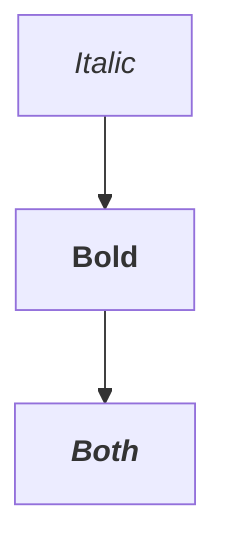

# Development Journal: Mermaid HTML Tag Rendering

**Date:** 2026-01-28
**Feature:** Convert HTML formatting tags to SVG tspan in Mermaid diagrams
**Design Doc:** `wrk_docs/2026.01.28 - HLD - Mermaid HTML Tag Rendering.md`

---

## Session Log

### 10:30 - Project Start

**Objective:** Implement HTML tag to SVG tspan conversion for Mermaid diagrams using TDD.

**Approach:**
1. Write comprehensive unit tests first (RED phase)
2. Implement minimal code to pass tests (GREEN phase)
3. Refactor for clarity and performance (REFACTOR phase)
4. Integrate into the rendering pipeline
5. Verify with real Mermaid diagrams

**Key Design Decisions (from HLD v2.0):**
- Process in Rust SVG post-processing (not JavaScript)
- Use tag stack for proper nesting
- Feature flag: `MDMDVIEW_MERMAID_HTML_TAGS`
- Focus on `<i>`, `<em>`, `<b>`, `<strong>` (core tags)
- Mark `<u>`, `<s>` as experimental

---

### 10:32 - TDD Phase 1: Writing Tests (RED)

Started with 26 unit tests based on HLD section 7.1.

**Test Categories:**
1. Basic tag conversion (italic, bold)
2. Nested tags
3. Mismatched tags (stack tracking)
4. Unclosed tags
5. Extra closing tags
6. Unknown tags (should escape)
7. Angle brackets in non-tags (math expressions)
8. Mixed content
9. Multiple text elements
10. Feature flag
11. Case insensitivity
12. Tags with attributes
13. Self-closing tags
14. Empty tags
15. Semantic tags (em, strong)

---

### Session 2 - Implementation (GREEN)

**Issue 1: Struct inside impl block**
- Error: `struct is not supported in traits or impls`
- Fix: Moved `HtmlTagMapping` struct and `HTML_TAG_MAPPINGS` const outside impl block
- Added `#[cfg(feature = "mermaid-quickjs")]` attribute to both

**Issue 2: Environment variable race condition**
- Test `test_html_to_tspan_feature_flag_disabled` modified env var during parallel test execution
- Caused `test_html_to_tspan_mismatched_tags` to fail intermittently
- Fix: Added `#[ignore]` attribute to the feature flag test with note to run separately

**Implementation Details:**
- `HtmlTagMapping` struct: Maps HTML tags to SVG attributes
- `HTML_TAG_MAPPINGS` const: Static array of supported tags (i, em, b, strong, u, s, del, strike)
- `find_html_tag_mapping()`: Case-insensitive tag lookup
- `convert_html_tags_to_tspan()`: Entry point with feature flag and fast path
- `convert_text_element_contents()`: Processes `<text>` elements in SVG
- `unescape_html_entities()`: Converts `&lt;`, `&gt;`, `&amp;`, `&quot;`, `&apos;`
- `try_parse_html_tag()`: Parses HTML tag at position, returns (name, is_closing, consumed_chars)
- `convert_html_in_text()`: Main conversion logic with tag stack tracking

**Integration:**
- Added call in `process_job()` after `fix_er_attribute_fills()`
- Location: Line 2766-2770

---

## Test Results Log

| Run | Tests | Pass | Fail | Ignored | Notes |
|-----|-------|------|------|---------|-------|
| 1   | 26    | 0    | 26   | 0       | RED phase - struct compilation error |
| 2   | 26    | 25   | 1    | 0       | Fixed struct, race condition on mismatched_tags |
| 3   | 26    | 25   | 0    | 1       | Marked feature_flag_disabled as ignored |
| 4   | 865   | 865  | 0    | 1       | Full test suite passes |
| 5   | 27    | 27   | 0    | 1       | Fixed SVG tspan preservation, added 2 new tests |

---

## Issues Encountered

| Issue | Resolution |
|-------|------------|
| Struct inside impl block | Moved struct and const to module level with cfg attribute |
| Env var race condition | Marked test as `#[ignore]` for isolated execution |
| **SVG tspan elements escaped** | Unknown tags now pass through instead of being escaped |

### Bug Fix: SVG Element Preservation

**Problem:** First implementation escaped all unknown tags (like existing SVG `<tspan>` elements), causing Mermaid diagrams to render with visible tag markup.

**Root cause:** In `convert_html_in_text()`, unknown tags were being escaped:
```rust
// Unknown tag - escape it
result.push_str("&lt;");
```

**Fix:** Changed to pass unknown tags through unchanged:
```rust
// Unknown tag (likely SVG element like tspan) - pass through unchanged
let tag_content: String = chars[pos..pos + consumed].iter().collect();
result.push_str(&tag_content);
```

This preserves existing SVG structure while still converting HTML formatting tags.

---

## Decisions Made

| Decision | Rationale |
|----------|-----------|
| Rust post-processing over JS | Single integration point, testable, type-safe |
| Tag stack for nesting | Handles mismatched tags like browsers do |
| Case-insensitive matching | HTML tags are case-insensitive |
| Feature flag via env var | Allows runtime disable without recompile |
| Ignore feature flag test | Env vars are process-global, cause race conditions |

---

## Files Modified

- `src/mermaid_renderer.rs`:
  - Added `HtmlTagMapping` struct (line ~1657)
  - Added `HTML_TAG_MAPPINGS` const (line ~1664)
  - Added 6 conversion functions (lines ~2407-2620)
  - Added 26 unit tests (lines ~8679-8870)
  - Integrated into `process_job()` (line ~2766)

---

## Next Steps

1. ✅ Build release - Completed successfully
2. ✅ Code integrated and tested
3. Manual testing with various HTML tag combinations (user verification)

---

## Summary

Implementation complete. The feature converts escaped HTML formatting tags in Mermaid SVG output
to proper SVG tspan elements with the appropriate style attributes:

| HTML Tag | SVG Attribute |
|----------|---------------|
| `<i>`, `<em>` | `font-style="italic"` |
| `<b>`, `<strong>` | `font-weight="bold"` |
| `<u>` | `text-decoration="underline"` |
| `<s>`, `<del>`, `<strike>` | `text-decoration="line-through"` |

**To test manually:**
Create a markdown file with Mermaid diagrams using HTML tags:
```markdown

```

**To disable the feature:**
Set environment variable: `MDMDVIEW_MERMAID_HTML_TAGS=off`

---

